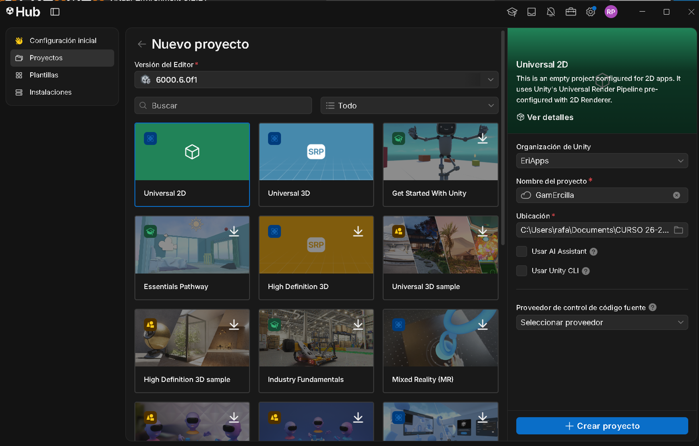
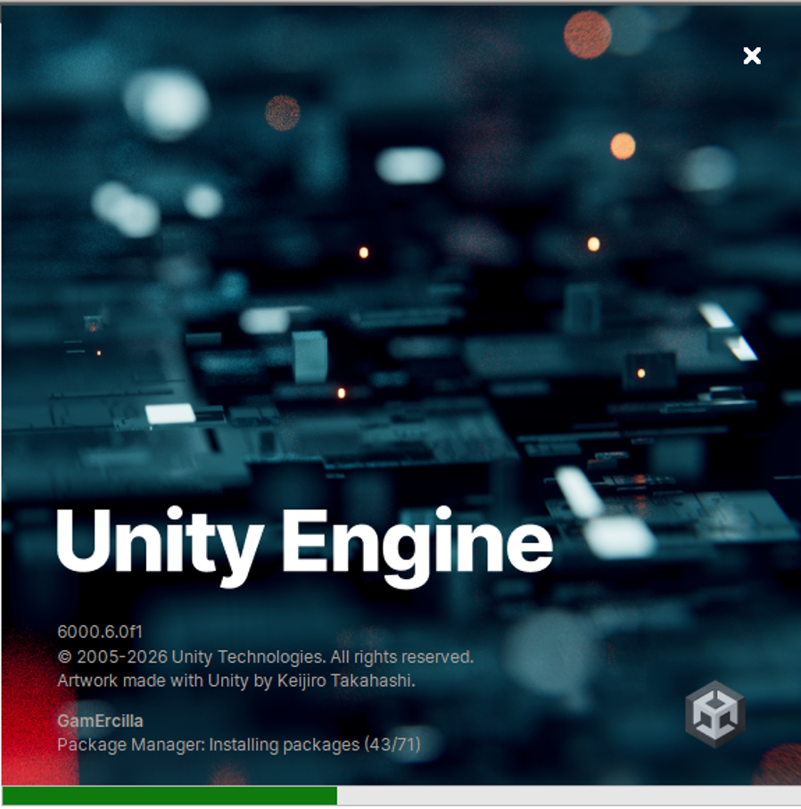
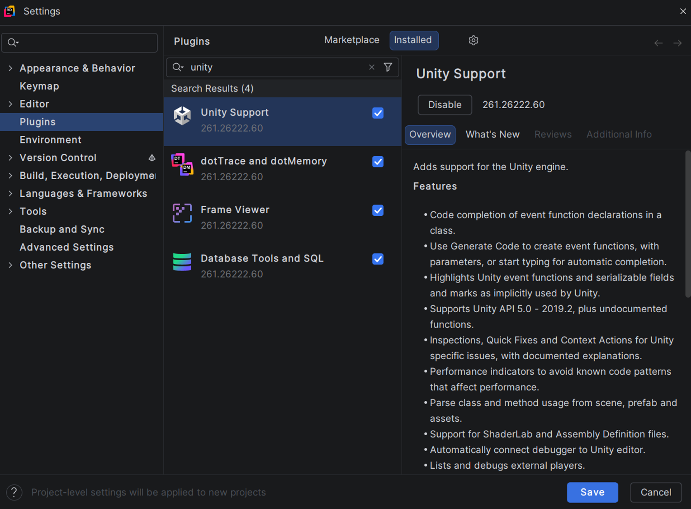
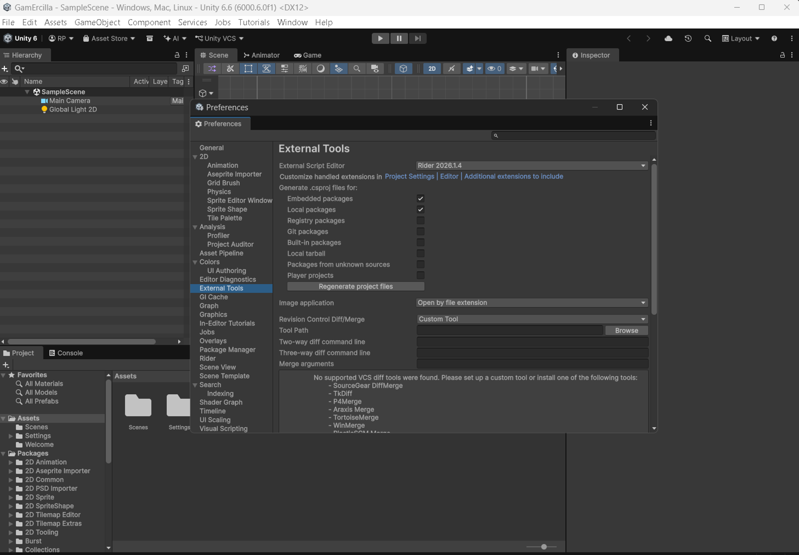
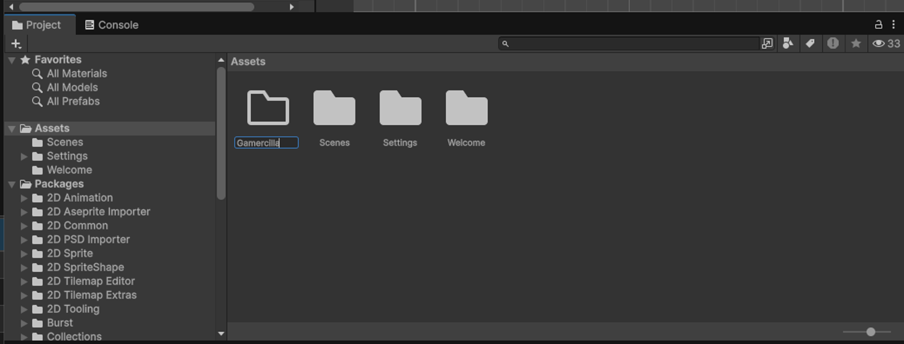

# 1. Crear el proyecto

## Objetivo

Crear un proyecto 2D en Unity 6, dejar preparado el editor y organizar desde el principio las carpetas que vamos a utilizar.

## Crear el proyecto

### 1. Preparar el proyecto en Unity Hub

Abre **Unity Hub** y pulsa **Nuevo proyecto**. En esta pantalla:

1. Selecciona la **versión del Editor** indicada por el profesor. En la captura se utiliza Unity **6000.6.0f1**.
2. Elige la plantilla **Universal 2D**.
3. Escribe **GamErcilla** como nombre del proyecto.
4. Selecciona la **ubicación** donde guardarás el trabajo.
5. Deja desmarcadas las opciones **Usar AI Assistant** y **Usar Unity CLI**, tal como aparecen en la captura.
6. Pulsa **Crear proyecto**.



!!! note
    Para las prácticas de clase utilizaremos Unity 6 y la plantilla **Universal 2D**. La versión instalada y la ruta de guardado pueden variar entre equipos; utiliza las indicadas en clase.

### 2. Esperar a que Unity prepare el proyecto

Unity abrirá el proyecto y preparará sus paquetes. Espera a que termine la pantalla de carga y aparezca el editor antes de continuar.



## Configurar Rider

### 3. Comprobar el soporte de Unity en Rider

Abre **Rider** y entra en **Settings → Plugins → Installed**. Busca `unity` y comprueba que **Unity Support** está activado.

En la captura, la casilla marcada y el botón **Disable** indican que el complemento ya está habilitado. Guarda los ajustes con **Save** si has realizado algún cambio.



### 4. Seleccionar Rider como editor de scripts

Vuelve a **Unity** y abre:

```text
Edit
→ Preferences
→ External Tools
→ External Script Editor
→ Rider
```

A partir de ese momento, al abrir un script C# desde Unity se utilizará Rider.

Selecciona tu versión instalada de Rider en **External Script Editor**, como se muestra en la captura.



## Organización inicial

### 5. Crear la carpeta del juego

En el panel **Project**, selecciona **Assets**. Haz clic con el botón derecho en su contenido y elige **Create → Folder**. Escribe **Gamercilla** y pulsa **Intro** para confirmar el nombre.



Dentro de `Gamercilla`, crea las carpetas que utilizaremos para separar los recursos por tipo:

```text
Assets
└── Gamercilla
    ├── Animations
    ├── Scripts
    ├── Sprites
    └── Tiles
```

No es obligatorio utilizar exactamente estos nombres, pero sí mantener una estructura clara desde el principio.
