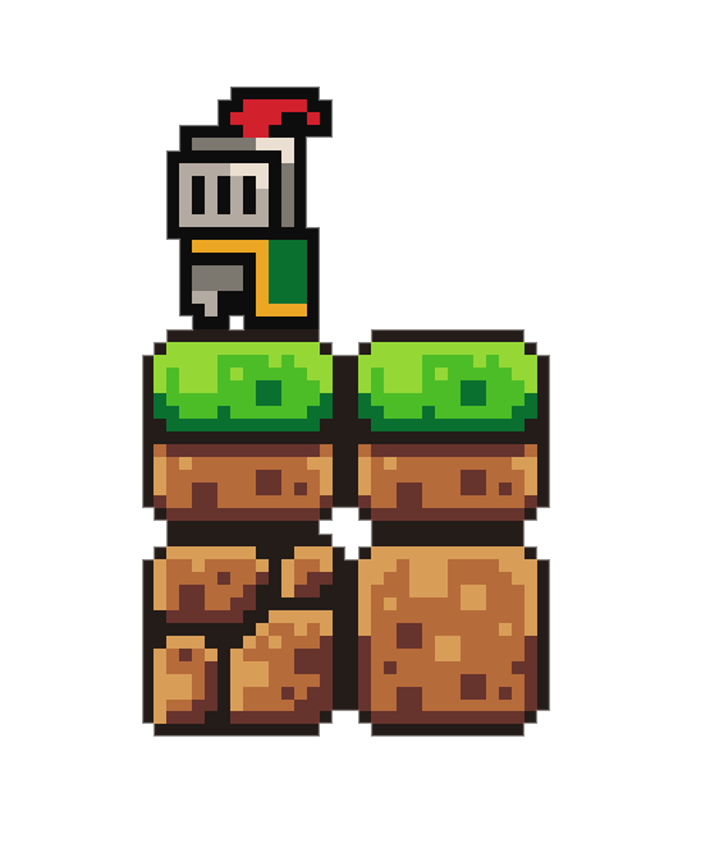
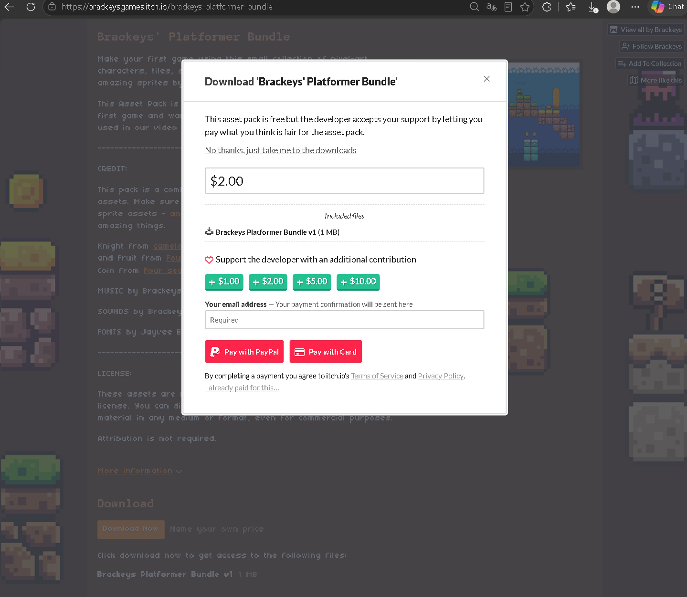
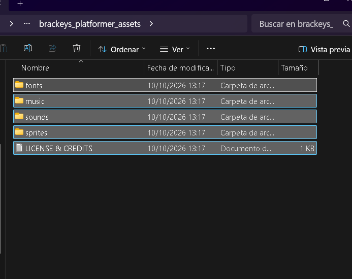
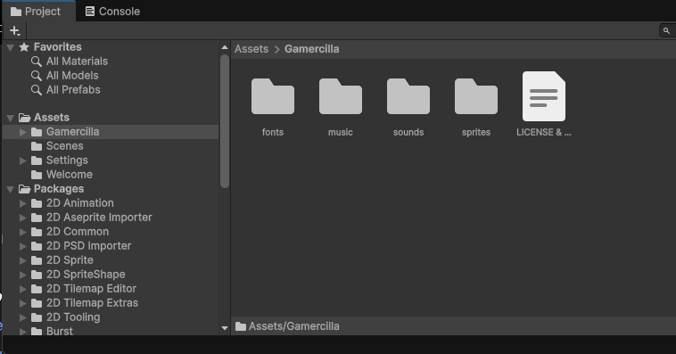
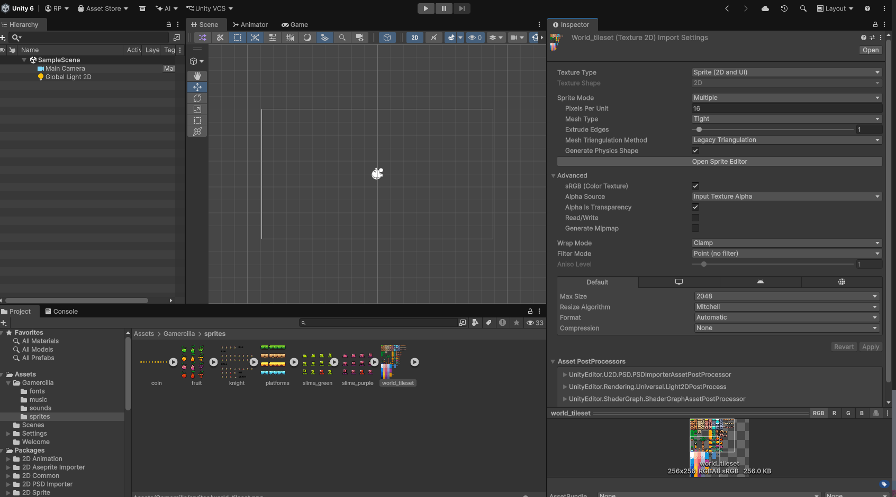
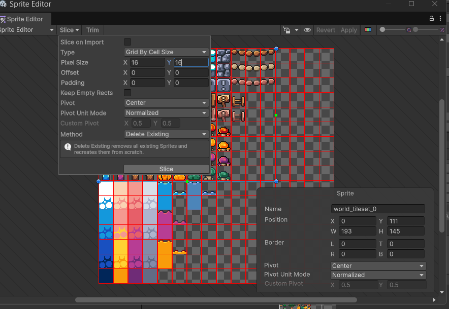

# 3. Assets y sprites

Los **assets** son los recursos del juego: imágenes, sonidos, música, fuentes, scripts, etc. Un **sprite** es una imagen 2D; una **spritesheet** reúne varios sprites o fotogramas en un mismo archivo. Para construir el escenario utilizaremos piezas reutilizables llamadas **tiles**.

En esta práctica descargaremos los recursos, los importaremos y separaremos las imágenes del escenario y del personaje.

## Descargar recursos gratuitos

Podemos encontrar recursos para videojuegos en distintas páginas:

- [Kenney · Pixel Platformer](https://kenney.nl/assets/pixel-platformer): un paquete de recursos para plataformas.
- [itch.io · Recursos 2D gratuitos](https://itch.io/game-assets/free/tag-2d): un catálogo de sprites, personajes, escenarios y otros assets.

**Nosotros utilizaremos [Brackeys' Platformer Bundle](https://brackeysgames.itch.io/brackeys-platformer-bundle)**, que incluye sprites, música, sonidos y fuentes.

<figure class="unity-shot" markdown="1">

[{ loading=lazy }](../../assets/images/pmdm/unity/06-brackeys-recursos.png){ aria-label="Ampliar imagen" }

<figcaption>Ejemplo del personaje y las piezas de terreno del paquete de Brackeys.</figcaption>
</figure>

1. Abre la página del paquete y pulsa **Download Now**.
2. Puedes hacer una donación o descargarlo gratis pulsando **No thanks, just take me to the downloads**.
3. Descarga el archivo y **descomprime el ZIP** antes de importarlo.

<figure class="unity-shot" markdown="1">

[{ loading=lazy }](../../assets/images/pmdm/unity/07-brackeys-descarga.png){ aria-label="Ampliar imagen" }

<figcaption>Descarga gratuita: pulsa «No thanks, just take me to the downloads» o realiza una donación.</figcaption>
</figure>

## Importar recursos

En el explorador de archivos, abre la carpeta descomprimida `brackeys_platformer_assets`. Verás las carpetas `fonts`, `music`, `sounds` y `sprites`, además del archivo de licencia y créditos.

<figure class="unity-shot" markdown="1">

[{ loading=lazy }](../../assets/images/pmdm/unity/08-brackeys-descomprimido.png){ aria-label="Ampliar imagen" }

<figcaption>Contenido del ZIP descomprimido: fuentes, música, sonidos, sprites y créditos.</figcaption>
</figure>

Selecciona ese contenido y arrástralo desde el explorador hasta **Assets → Gamercilla**, en la ventana **Project** de Unity. Espera a que termine la importación. Arrastramos las carpetas descomprimidas, no el ZIP ni las imágenes a la escena.

<figure class="unity-shot" markdown="1">

[{ loading=lazy }](../../assets/images/pmdm/unity/09-unity-recursos-importados.png){ aria-label="Ampliar imagen" }

<figcaption>Los recursos importados aparecen dentro de Assets/Gamercilla en la ventana Project.</figcaption>
</figure>

## Configurar sprites de pixel art

Abre **Assets → Gamercilla → sprites** y selecciona primero **`world_tileset`**, la imagen que contiene las piezas del terreno y los elementos decorativos.

En **Inspector**, ajusta:

| Propiedad | Valor | Para qué sirve |
| --- | --- | --- |
| **Texture Type** | `Sprite (2D and UI)` | Importar la imagen como sprites. |
| **Sprite Mode** | `Multiple` | Separar los elementos de la hoja. |
| **Pixels Per Unit** | `16` | Usar 16 píxeles por unidad de Unity. |
| **Filter Mode** | `Point (no filter)` | Conservar los bordes del pixel art sin suavizado. |
| **Compression** | `None` | Evitar los artefactos de compresión. |
| **Generate Mipmap** | Desactivado | Prescindir de versiones reducidas de la textura en esta práctica 2D. |

**Pulsa Apply en el Inspector** para guardar la configuración antes de abrir el Sprite Editor.

<figure class="unity-shot" markdown="1">

[{ loading=lazy }](../../assets/images/pmdm/unity/10-unity-importacion-sprites.png){ aria-label="Ampliar imagen" }

<figcaption>Inspector de world_tileset: Multiple, 16 PPU, Point y Compression None.</figcaption>
</figure>

### Qué significa Pixels Per Unit

**Pixels Per Unit (PPU) es un número: escribimos `16`, no `16×16`.** Indica cuántos píxeles de la imagen equivalen a una unidad de distancia en la escena.

- Un recorte de **16×16 píxeles**, con **16 PPU**, ocupa **1×1 unidades**.
- Un recorte de **32×32 píxeles**, con los mismos **16 PPU**, ocupa **2×2 unidades**, aunque parte de la imagen sea transparente.

Si aumentas los PPU, el sprite se verá más pequeño en la escena; si los reduces, se verá más grande. Para que todas las piezas mantengan la misma escala, **conservaremos 16 PPU en los recursos de este paquete**. El tamaño del recorte se configura por separado.

## Trocear la spritesheet

Con `world_tileset` seleccionado:

1. Pulsa **Open Sprite Editor** en el Inspector.
2. En el Sprite Editor, abre **Slice**.
3. Selecciona **Type → Grid By Cell Size**.
4. En **Pixel Size**, escribe **X = 16** e **Y = 16**. Para esta hoja, deja **Offset** y **Padding** en `0`.
5. Pulsa el botón **Slice** del desplegable para generar los recortes.
6. Pulsa **Apply**, arriba en el Sprite Editor, para guardarlos. Después puedes cerrar la ventana.

<figure class="unity-shot" markdown="1">

[{ loading=lazy }](../../assets/images/pmdm/unity/11-unity-slice-16.png){ aria-label="Ampliar imagen" }

<figcaption>Slice: Grid By Cell Size y celdas de 16×16; después pulsa Slice y Apply.</figcaption>
</figure>

!!! important "Dos ajustes, dos guardados"
    **Apply en el Inspector** guarda la configuración de importación. **Slice y después Apply en el Sprite Editor** generan y guardan los recortes. No basta con escribir el tamaño de celda y cerrar la ventana.

## Repetir con los recursos que vayamos a utilizar

Repite la configuración y el recorte con cada hoja que vayas a usar. Para este paquete:

| Hoja | Pixels Per Unit | Recorte en Slice |
| --- | --- | --- |
| `world_tileset` · terreno y decoración | `16` | `16×16` píxeles |
| `platforms` · plataformas | `16` | `16×16` píxeles |
| `knight` · personaje que usaremos como Player | `16` | `32×32` píxeles |

Para **`knight`**, utiliza **Sprite Mode → Multiple** y **Grid By Cell Size**, pero cambia **Pixel Size** a **X = 32, Y = 32**. Los PPU siguen siendo `16`.

Para monedas, frutas, enemigos u otras hojas, comprueba el tamaño real de cada fotograma antes de recortar: no todas las imágenes se dividen en 16×16. Los tamaños de otros paquetes también pueden ser distintos; por ejemplo, el Pixel Platformer de Kenney usa tiles de 18×18.

Al terminar, despliega la flecha de la imagen en **Project** y comprueba que aparecen sus sprites individuales. Si un recorte corta un personaje o mezcla dos piezas, revisa el tamaño de celda.

## Continuar con el mapa

Con los sprites preparados, podemos [crear el escenario con Grid, Tilemap y Tile Palette](06-tilemap-escenario.md). En esa página separaremos el suelo de la decoración y dibujaremos el recorrido.

Referencias: [ajustes de importación de sprites de Unity](https://docs.unity3d.com/6000.0/Documentation/Manual/texture-type-sprite.html) y las páginas de los paquetes enlazadas arriba.
