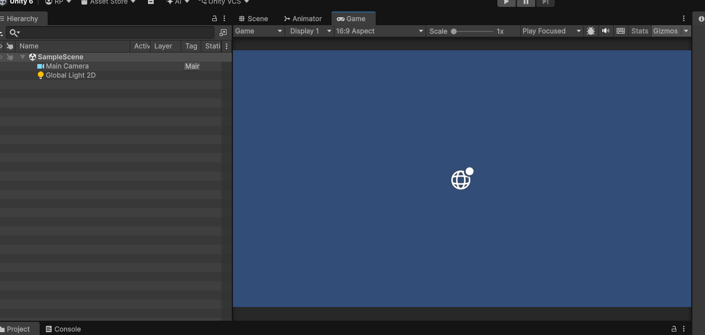
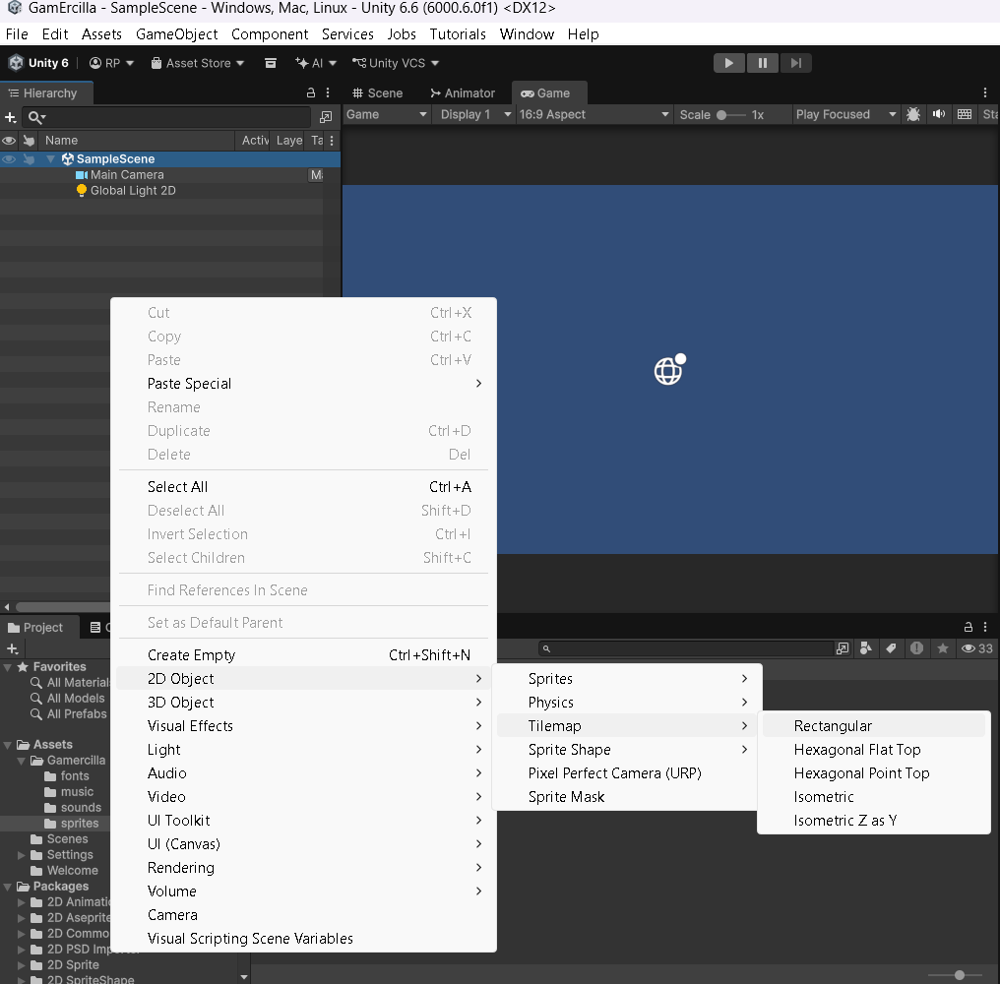
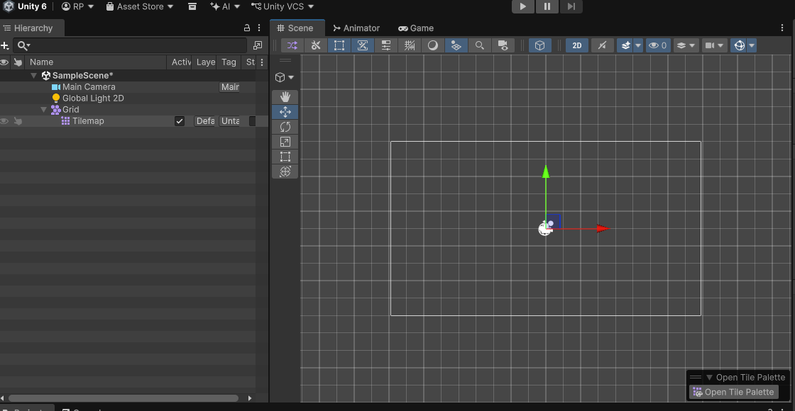
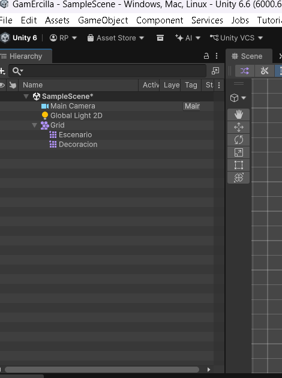
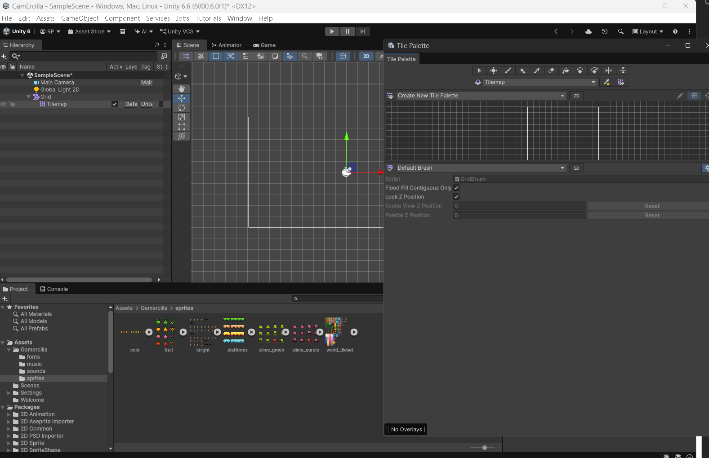
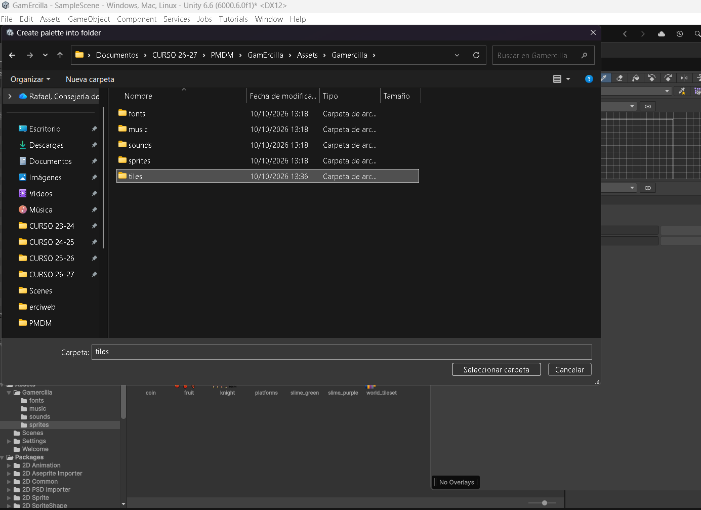
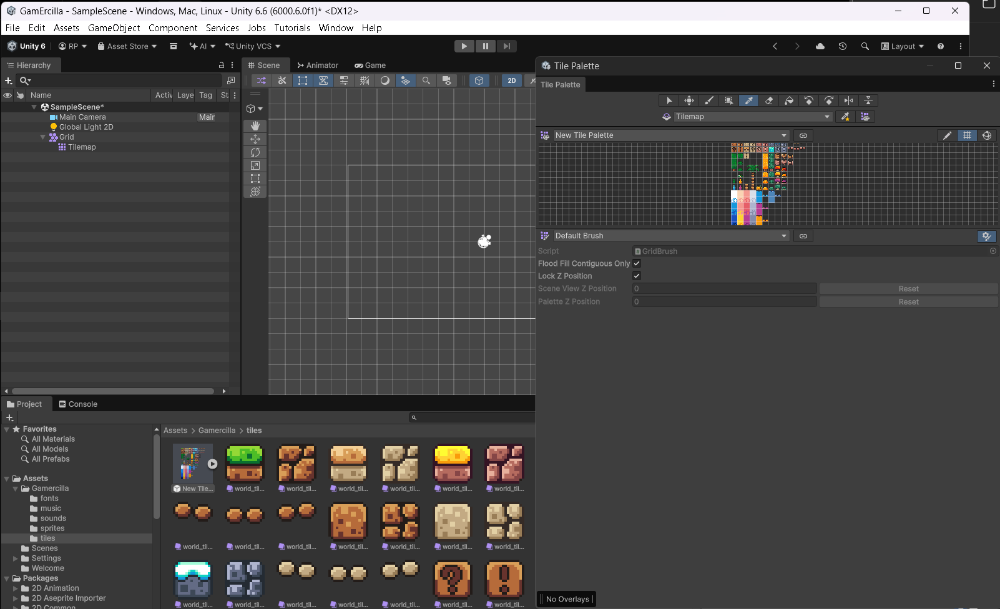
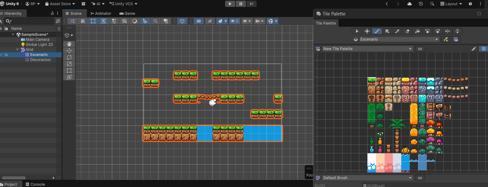
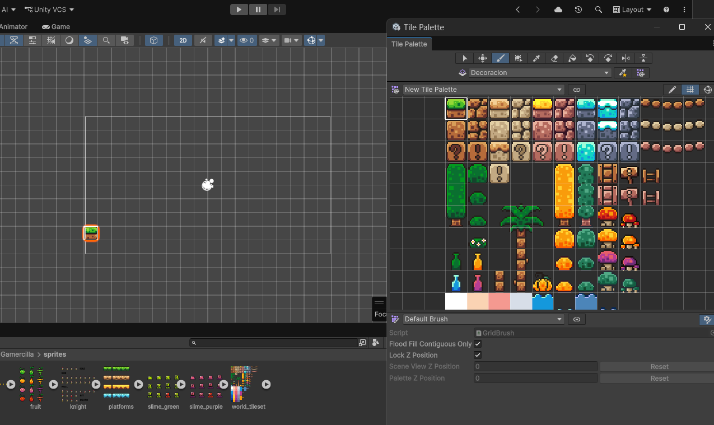
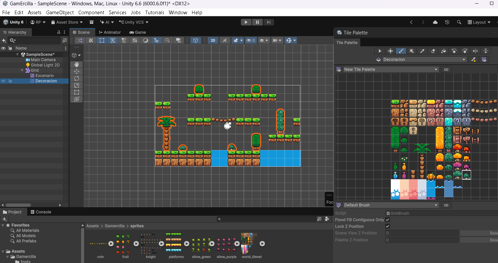

# 6. Escenario con Tilemap

Las **Tilemaps** permiten construir escenarios 2D a partir de piezas reutilizables. Antes de empezar, [importa y recorta los sprites](03-assets-sprites.md): aquí utilizaremos `world_tileset` y, si las necesitamos, las piezas de `platforms`.

## Preparar el editor y la vista Game

1. Si quieres recuperar la distribución inicial de las ventanas, abre **Layout**, en la esquina superior derecha de Unity, y selecciona **Default**. Este ajuste organiza los paneles del editor; no cambia el mapa ni el tamaño de los sprites.
2. Abre la pestaña **Game** y, en el desplegable de proporción de su barra superior, elige **16:9 Aspect**. Si no aparece, utiliza **+** para añadir una proporción (**Aspect Ratio**) de ancho `16` y alto `9`.
3. Vuelve a **Scene** y activa la vista **2D** para dibujar el mapa.

<figure class="unity-shot" markdown="1">

[{ loading=lazy }](../../assets/images/pmdm/unity/12-unity-game-16-9.png){ aria-label="Ampliar imagen" }

<figcaption>Pestaña Game configurada con la proporción 16:9 Aspect.</figcaption>
</figure>

!!! note "Proporción de la vista"
    **16:9** define la proporción de la vista Game. No es el tamaño de los tiles ni una resolución fija como 1920×1080. Utiliza el encuadre de la cámara como referencia para el primer mapa.

## Crear el Grid y el primer Tilemap

En un espacio vacío de **Hierarchy**, haz clic con el botón derecho y selecciona **2D Object → Tilemap → Rectangular**.

<figure class="unity-shot" markdown="1">

[{ loading=lazy }](../../assets/images/pmdm/unity/13-unity-crear-tilemap.png){ aria-label="Ampliar imagen" }

<figcaption>Hierarchy → 2D Object → Tilemap → Rectangular.</figcaption>
</figure>

Unity creará un objeto **Grid** con un **Tilemap** como hijo. El Grid define la cuadrícula; el Tilemap guarda las piezas que pintamos en sus celdas.

<figure class="unity-shot" markdown="1">

[{ loading=lazy }](../../assets/images/pmdm/unity/14-unity-grid-tilemap.png){ aria-label="Ampliar imagen" }

<figcaption>Unity crea un Grid con un Tilemap hijo. Open Tile Palette permite abrir la paleta.</figcaption>
</figure>

Renombra este primer Tilemap como **`Escenario`**. En el Grid, conserva **Cell Size: X = 1, Y = 1** y los valores iniciales de posición y escala. Así, las piezas de 16×16 con 16 PPU encajan en celdas de 1×1 unidades.

## Separar suelo y decoración

Selecciona el **Grid** en Hierarchy y vuelve a crear **2D Object → Tilemap → Rectangular**. Renombra el nuevo Tilemap como **`Decoracion`** y comprueba que los dos son hijos del **mismo Grid**.

<figure class="unity-shot" markdown="1">

[{ loading=lazy }](../../assets/images/pmdm/unity/18-unity-dos-tilemaps.png){ aria-label="Ampliar imagen" }

<figcaption>Escenario y Decoracion son dos Tilemaps distintos dentro del mismo Grid.</figcaption>
</figure>

| Tilemap | Qué dibujaremos en él | Colisiones |
| --- | --- | --- |
| **`Escenario`** | Suelo, paredes y plataformas que pisan o bloquean al jugador. | Las añadiremos en [Colisiones y físicas](07-colisiones-fisicas.md). |
| **`Decoracion`** | Árboles, arbustos y elementos que solo adornan. | No añadiremos colliders para esta decoración. |

Los nombres `Ground` y `Decoration` del ejemplo general ERCIGAME cumplen estas mismas funciones. En este proyecto usaremos **`Escenario` y `Decoracion`**, como en las capturas.

## Crear una Tile Palette

Selecciona un Tilemap y pulsa **Open Tile Palette** en la vista Scene. También puedes abrirla desde **Window → 2D → Tile Palette**.

<figure class="unity-shot" markdown="1">

[{ loading=lazy }](../../assets/images/pmdm/unity/15-unity-crear-paleta.png){ aria-label="Ampliar imagen" }

<figcaption>Tile Palette vacía: crea la paleta antes de incorporar las piezas del escenario.</figcaption>
</figure>

1. En el desplegable de paletas, elige **Create New Tile Palette** (o **Create New Palette**, según la versión).
2. Ponle un nombre, por ejemplo **`PaletaEscenario`**, y selecciona una cuadrícula **Rectangle**.
3. Pulsa **Create** y guarda la paleta dentro de **Assets/Gamercilla/tiles**. Crea esa carpeta si todavía no existe.

<figure class="unity-shot" markdown="1">

[{ loading=lazy }](../../assets/images/pmdm/unity/16-unity-guardar-paleta.png){ aria-label="Ampliar imagen" }

<figcaption>Guarda la paleta y los Tile assets en Assets/Gamercilla/tiles.</figcaption>
</figure>

En **Project → Assets → Gamercilla → sprites**, despliega `world_tileset` y arrastra sus sprites recortados al área cuadriculada de la **Tile Palette**. También puedes arrastrar la hoja ya recortada para incorporar sus piezas.

Cuando Unity pregunte dónde guardar los **Tile assets** generados, selecciona **Assets/Gamercilla/tiles**. Si necesitas las plataformas, repite el arrastre con los sprites de `platforms`.

<figure class="unity-shot" markdown="1">

[{ loading=lazy }](../../assets/images/pmdm/unity/17-unity-paleta-tiles.png){ aria-label="Ampliar imagen" }

<figcaption>La paleta contiene las piezas recortadas; los Tile assets aparecen en la carpeta tiles.</figcaption>
</figure>

!!! note "Paleta, tiles y mapa"
    La **paleta** es el catálogo desde el que elegimos piezas. Los **Tile assets** son los archivos que Unity genera para esas piezas. El **Tilemap** es el objeto de la escena en el que dibujamos. La misma paleta puede servir para pintar en `Escenario` y en `Decoracion`.

En las capturas la paleta aparece con el nombre inicial **New Tile Palette**; cumple la misma función que nuestra `PaletaEscenario`.

## Dibujar el recorrido

1. En el desplegable de destino de la **Tile Palette** (**Active Tilemap**), selecciona **`Escenario`**.
2. Elige una pieza de suelo en la paleta y activa la herramienta **Paint** (pincel).
3. En la vista **Scene**, pulsa o arrastra sobre la cuadrícula para dibujar el suelo y las plataformas del recorrido. Puedes seleccionar varias celdas de la paleta para pintar una pieza compuesta.
4. Utiliza **Erase** (goma) para borrar una celda y **Ctrl+Z** para deshacer un trazo.

<figure class="unity-shot" markdown="1">

[{ loading=lazy }](../../assets/images/pmdm/unity/20-unity-dibujar-escenario.png){ aria-label="Ampliar imagen" }

<figcaption>Recorrido dibujado con Escenario seleccionado como destino en la Tile Palette.</figcaption>
</figure>

## Añadir la decoración

Cambia **Active Tilemap** a **`Decoracion`**, elige árboles, arbustos u otras piezas decorativas y píntalas sobre la escena. Los elementos grandes pueden estar formados por varias celdas; selecciona el conjunto en la paleta para colocarlo completo.

<figure class="unity-shot" markdown="1">

[{ loading=lazy }](../../assets/images/pmdm/unity/19-unity-destino-pincel.png){ aria-label="Ampliar imagen" }

<figcaption>El desplegable superior indica Decoracion: comprueba el destino antes de pintar suelo.</figcaption>
</figure>

!!! warning "Comprueba el Tilemap antes de cada trazo"
    **Antes de pintar, mira el destino seleccionado en la Tile Palette.** Elegir una pieza de suelo no cambia automáticamente el destino a `Escenario`. En la captura anterior está seleccionado `Decoracion`: es una demostración del pincel, no el destino que debemos usar para el suelo sólido.

<figure class="unity-shot" markdown="1">

[{ loading=lazy }](../../assets/images/pmdm/unity/21-unity-dibujar-decoracion.png){ aria-label="Ampliar imagen" }

<figcaption>Árboles y arbustos añadidos con Decoracion seleccionado como destino.</figcaption>
</figure>

Para controlar qué queda delante, puedes usar **Order in Layer** en el componente **Tilemap Renderer**: por ejemplo, `Escenario = 0` y `Decoracion = -1` para que la decoración quede detrás. Si alguna decoración debe quedar delante, dale un orden mayor o sepárala en otro Tilemap.

Dibujar agua u otros elementos no les añade comportamiento por sí solo. Si son solo visuales, colócalos en `Decoracion`; si deben causar daño o tener otra interacción, lo programaremos por separado.

## Fondo

Si utilizas una imagen de fondo, configúrala en su **Sprite Renderer** con un **Order in Layer** menor que el de los Tilemaps. Con los valores del ejemplo anterior, puedes usar **`-2`** para el fondo.

## Guardar y continuar

Guarda la escena con **Ctrl+S** y comprueba el resultado en **Game**. El mapa ya está dibujado, pero el suelo todavía necesita los componentes de [Colisiones y físicas](07-colisiones-fisicas.md) para que el jugador pueda pisarlo.

Referencias: [distribución de ventanas de Unity](https://docs.unity3d.com/6000.0/Documentation/Manual/CustomizingYourWorkspace.html), [vista Game](https://docs.unity3d.com/6000.0/Documentation/Manual/GameView.html) y [creación de Tile Palettes](https://docs.unity3d.com/6000.0/Documentation/Manual/tilemaps/tiles-for-tilemaps/create-tile-palette-landing.html).
