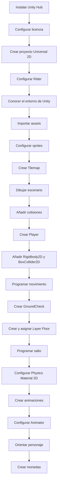

# 11. ERCIGAME 2D · Ejemplo completo

Este ejemplo reúne en un único proyecto los contenidos trabajados en los apartados anteriores. Puede utilizarse como referencia para comprobar el proceso completo antes de realizar la práctica individual.

En esta práctica vamos a crear la base de un videojuego de plataformas 2D en Unity.

Al terminar tendremos:

- Un escenario construido con **Tilemap**.
- Un personaje con físicas.
- Movimiento horizontal.
- Salto con detección de suelo.
- Animaciones básicas.
- Cambio de orientación del personaje.
- Monedas que se pueden recoger.

---

## Esquema de trabajo

```text
Preparar Unity
    ↓
Crear proyecto Universal 2D
    ↓
Conocer el entorno de Unity
    ↓
Importar y configurar assets
    ↓
Crear escenario con Tilemap
    ↓
Añadir colisiones al escenario
    ↓
Crear Player
    ↓
Añadir Rigidbody2D y Collider
    ↓
Programar movimiento
    ↓
Crear GroundCheck + Layer Floor
    ↓
Programar salto
    ↓
Configurar físicas
    ↓
Crear animaciones
    ↓
Configurar Animator
    ↓
Orientar personaje
    ↓
Crear monedas
```

## Diagrama de flujo



---

## 1. Preparar Unity

### Instalar Unity Hub

Instalamos **Unity Hub** y desde él una versión de **Unity 6**.

También debemos disponer de una licencia activa de Unity.

---

## 2. Crear el proyecto

En Unity Hub:

1. Pulsar **New project**.
2. Seleccionar la plantilla **Universal 2D**.
3. Indicar el nombre del proyecto.
4. Seleccionar su ubicación.
5. Crear el proyecto.

---

## 3. Configurar Rider

En Unity:

```text
Edit
→ Preferences
→ External Tools
→ External Script Editor
→ Rider
```

Rider será el editor que utilizaremos para escribir los scripts en C#.

---

## 4. Conocer el entorno de Unity

Seleccionamos el **Layout Default**.

En la pestaña **Game** podemos establecer una relación de aspecto de:

```text
16:9
```

### Hierarchy

La ventana **Hierarchy** contiene los objetos que existen en la escena:

- Personajes.
- Cámaras.
- Luces.
- Suelo.
- Plataformas.
- Monedas.
- Obstáculos.

#### SampleScene

Es la escena actual.

Una escena puede representar, por ejemplo:

- Un nivel.
- Un menú principal.
- Una pantalla de victoria.
- Una pantalla de Game Over.

#### Main Camera

Es la cámara del juego.

Determina qué parte del escenario verá el jugador.

#### Global Light 2D

Controla la iluminación general de la escena 2D.

---

## 5. Importar los assets

Utilizaremos como punto de partida:

[**Brackeys' Platformer Bundle**](https://brackeysgames.itch.io/brackeys-platformer-bundle)

Dentro de:

```text
Assets
```

creamos:

```text
ErciGame
```

Arrastramos dentro las carpetas de recursos que vayamos a utilizar.

Una estructura sencilla puede ser:

```text
Assets
└── ErciGame
    ├── Animations
    ├── Scripts
    ├── Sprites
    └── Tiles
```

---

## 6. Configurar sprites

Para los sprites de pixel art:

```text
Texture Type: Sprite (2D and UI)
Filter Mode: Point (no filter)
Compression: None
Pixels Per Unit: 16
```

El modo **Point** evita que Unity suavice los píxeles.

### Spritesheets

Si una imagen contiene varios sprites:

```text
Sprite Mode: Multiple
```

Después:

```text
Open Sprite Editor
→ Slice
→ Type: Grid by Cell Size
→ Pixel Size: 16 x 16
→ Slice
→ Apply
```

Repetimos el proceso con los spritesheets que lo necesiten.

---

## 7. Crear el escenario

En **Hierarchy**:

```text
Botón derecho
→ 2D Object
→ Tilemap
→ Rectangular
```

Unity creará una estructura parecida a:

```text
Grid
└── Tilemap
```

Renombramos el Tilemap, por ejemplo:

```text
Ground
```

---

## 8. Crear la Tile Palette

Seleccionamos el Tilemap y abrimos:

```text
Window
→ 2D
→ Tile Palette
```

También puede aparecer la opción **Open Tile Palette** desde el Inspector.

Creamos una paleta y arrastramos los sprites que utilizaremos como tiles.

Guardamos los tiles generados en:

```text
Assets/ErciGame/Tiles
```

Ahora podemos pintar el escenario.

---

## 9. Separar escenario y decoración

Es recomendable utilizar Tilemaps diferentes.

Por ejemplo:

```text
Grid
├── Ground
└── Decoration
```

`Ground` contendrá los elementos con los que colisiona el jugador.

`Decoration` contendrá elementos puramente visuales.

---

## 10. Añadir el fondo

Arrastramos la imagen de fondo a la escena.

En su `Sprite Renderer` establecemos:

```text
Order in Layer: -1
```

Así permanecerá detrás del resto de elementos.

---

## 11. Crear el Player

Arrastramos el sprite del personaje a la escena y lo renombramos:

```text
Player
```

En su `Sprite Renderer` podemos establecer:

```text
Order in Layer: 10
```

Así se dibujará por encima del escenario.

---

## 12. Añadir colisiones y físicas al Player

Seleccionamos `Player` y añadimos:

```text
Box Collider 2D
Rigidbody 2D
```

En `Box Collider 2D` pulsamos:

```text
Edit Collider
```

y ajustamos el collider aproximadamente al cuerpo del personaje.

### Evitar que el personaje gire

En:

```text
Rigidbody 2D
→ Constraints
```

activamos:

```text
Freeze Rotation Z
```

---

## 13. Añadir colisiones al escenario

Seleccionamos el Tilemap `Ground` y añadimos:

```text
Tilemap Collider 2D
Composite Collider 2D
Rigidbody 2D
```

En el `Rigidbody 2D`:

```text
Body Type: Static
```

En `Tilemap Collider 2D`:

```text
Composite Operation: Merge
```

El `Tilemap Collider 2D` genera las colisiones de los tiles.

El `Composite Collider 2D` las combina para formar superficies más continuas.

---

## 14. Crear el script Player

Dentro de:

```text
Assets/ErciGame/Scripts
```

creamos:

```text
Player.cs
```

Lo arrastramos al objeto `Player`.

Código inicial:

```csharp
using UnityEngine;

public class Player : MonoBehaviour
{
    public float speed = 6f;

    private Rigidbody2D rb2D;
    private float move;

    void Start()
    {
        rb2D = GetComponent<Rigidbody2D>();
    }

    void Update()
    {
        move = Input.GetAxisRaw("Horizontal");

        rb2D.linearVelocity = new Vector2(
            move * speed,
            rb2D.linearVelocity.y
        );
    }
}
```

`Input.GetAxisRaw("Horizontal")` devuelve normalmente:

```text
-1 → izquierda
 0 → sin movimiento
 1 → derecha
```

---

## 15. Activar el sistema de Input utilizado

El código anterior utiliza el sistema de entrada clásico.

Vamos a:

```text
Edit
→ Project Settings
→ Player
→ Active Input Handling
```

Seleccionamos:

```text
Both
```

Unity solicitará reiniciar el editor.

---

## 16. Crear GroundCheck

Para permitir el salto necesitamos saber si el personaje está tocando el suelo.

En **Hierarchy**:

```text
Player
└── GroundCheck
```

Para crearlo:

1. Seleccionar `Player`.
2. Botón derecho.
3. Seleccionar **Create Empty**.
4. Renombrarlo `GroundCheck`.
5. Colocarlo justo debajo de los pies.

---

## 17. Crear la Layer Floor

Seleccionamos el Tilemap `Ground`.

En:

```text
Layer
→ Add Layer...
```

creamos:

```text
Floor
```

Después volvemos a seleccionar `Ground` y establecemos:

```text
Layer: Floor
```

!!! warning "Importante"
    La Layer `Floor` se asigna al **suelo**, no al Player.

---

## 18. Programar el salto

Ampliamos `Player.cs`:

```csharp
using UnityEngine;

public class Player : MonoBehaviour
{
    public float speed = 6f;
    public float jumpForce = 6f;

    private Rigidbody2D rb2D;
    private float move;
    private bool isGrounded;

    public Transform groundCheck;
    public float groundRadius = 0.1f;
    public LayerMask groundLayer;

    void Start()
    {
        rb2D = GetComponent<Rigidbody2D>();
    }

    void Update()
    {
        move = Input.GetAxisRaw("Horizontal");

        rb2D.linearVelocity = new Vector2(
            move * speed,
            rb2D.linearVelocity.y
        );

        if (Input.GetButtonDown("Jump") && isGrounded)
        {
            rb2D.linearVelocity = new Vector2(
                rb2D.linearVelocity.x,
                jumpForce
            );
        }
    }

    private void FixedUpdate()
    {
        isGrounded = Physics2D.OverlapCircle(
            groundCheck.position,
            groundRadius,
            groundLayer
        );
    }
}
```

---

## 19. Configurar GroundCheck en el Inspector

Seleccionamos `Player`.

En el componente `Player (Script)` configuramos:

```text
Ground Check  → GroundCheck
Ground Radius → 0.1
Ground Layer  → Floor
```

Para asignar `GroundCheck`, arrastramos el objeto hijo desde **Hierarchy** hasta el campo correspondiente.

La configuración debe quedar conceptualmente así:

```text
Player
├── Sprite Renderer
├── Rigidbody 2D
├── Box Collider 2D
├── Player (Script)
│   ├── Ground Check  → GroundCheck
│   ├── Ground Radius → 0.1
│   └── Ground Layer  → Floor
│
└── GroundCheck
```

Y el escenario:

```text
Grid
└── Ground
    ├── Layer = Floor
    ├── Tilemap Collider 2D
    ├── Composite Collider 2D
    └── Rigidbody 2D = Static
```

---

## 20. Evitar que el Player se quede pegado a paredes

En:

```text
Assets
→ Botón derecho
→ Create
→ 2D
→ Physics Material 2D
```

creamos un material, por ejemplo:

```text
PlayerPhysics
```

Configuramos:

```text
Friction: 0
```

Seleccionamos `Player` y asignamos este material al campo `Material` del:

```text
Box Collider 2D
```

---

## 21. Crear animaciones

Creamos:

```text
Assets/ErciGame/Animations
```

Seleccionamos `Player` y abrimos:

```text
Window
→ Animation
→ Animation
```

Creamos las animaciones necesarias:

```text
Idle.anim
Run.anim
Jump.anim
Death.anim
```

Para cada animación arrastramos a la ventana **Animation** los frames correspondientes.

En animaciones que no deben repetirse, como `Death`, desactivamos:

```text
Loop Time
```

---

## 22. Configurar Animator

El Player necesita un componente:

```text
Animator
```

Creamos o utilizamos un único:

```text
Animator Controller
```

y lo asignamos al campo:

```text
Animator
→ Controller
```

Abrimos:

```text
Window
→ Animation
→ Animator
```

Arrastramos las animaciones al Animator.

---

## 23. Animación Idle y Run

En **Parameters** creamos:

```text
Float → Speed
```

Creamos las transiciones:

```text
Idle → Run
Speed > 0.1
```

```text
Run → Idle
Speed < 0.1
```

En ambas:

```text
Has Exit Time: desactivado
Transition Duration: 0
```

---

## 24. Controlar el Animator desde C#

Añadimos al script:

```csharp
private Animator anim;
```

En `Start()`:

```csharp
anim = GetComponent<Animator>();
```

En `Update()`:

```csharp
anim.SetFloat("Speed", Mathf.Abs(move));
```

---

## 25. Animación de salto

En el Animator añadimos:

```text
Float → VerticalVelocity
Bool  → IsGrounded
```

Podemos crear una transición:

```text
Any State → Jump
```

con las condiciones:

```text
VerticalVelocity > 0.1
IsGrounded = false
```

Para volver:

```text
Jump → Idle
Speed < 0.1
IsGrounded = true
```

```text
Jump → Run
Speed > 0.1
IsGrounded = true
```

En el script actualizamos los parámetros:

```csharp
anim.SetFloat("VerticalVelocity", rb2D.linearVelocity.y);
anim.SetBool("IsGrounded", isGrounded);
```

---

## 26. Orientar al personaje

En lugar de modificar la escala del Player, utilizaremos `SpriteRenderer.flipX`.

Declaramos:

```csharp
private SpriteRenderer spriteRenderer;
```

En `Start()`:

```csharp
spriteRenderer = GetComponent<SpriteRenderer>();
```

En `Update()`:

```csharp
if (move != 0)
{
    spriteRenderer.flipX = move < 0;
}
```

Así el sprite mira hacia la dirección en la que se mueve sin modificar el tamaño del objeto ni sus colliders.

---

## 27. Crear una moneda

Seleccionamos el sprite de la moneda y configuramos sus frames.

Arrastramos la moneda a la escena y la llamamos:

```text
Coin
```

Añadimos:

```text
Circle Collider 2D
```

Ajustamos el collider con:

```text
Edit Collider
```

y activamos:

```text
Is Trigger
```

---

## 28. Animar la moneda

Creamos:

```text
Coin.anim
```

con los distintos frames de la moneda.

Podemos dejar activado:

```text
Loop Time
```

para que la animación se repita continuamente.

---

## 29. Crear Coin.cs

Dentro de:

```text
Assets/ErciGame/Scripts
```

creamos:

```text
Coin.cs
```

Código:

```csharp
using UnityEngine;

public class Coin : MonoBehaviour
{
    private void OnTriggerEnter2D(Collider2D collision)
    {
        if (collision.CompareTag("Player"))
        {
            Destroy(gameObject);
        }
    }
}
```

Arrastramos el script al objeto `Coin`.

---

## 30. Configurar el Tag del Player

Seleccionamos:

```text
Player
```

y establecemos:

```text
Tag: Player
```

Ahora, cuando el Player entre en el `Trigger` de la moneda, esta desaparecerá.

---

## Resultado

Al terminar esta práctica tendremos:

```text
✓ Escenario mediante Tilemap
✓ Colisiones
✓ Player con físicas
✓ Movimiento horizontal
✓ Salto
✓ Detección de suelo
✓ Animaciones
✓ Cambio de orientación
✓ Monedas recogibles
```

La estructura básica del proyecto será:

```text
Scene
├── Main Camera
├── Global Light 2D
├── Grid
│   ├── Ground
│   └── Decoration
├── Background
├── Player
│   └── GroundCheck
└── Coins
```

Y dentro de `Assets`:

```text
Assets
└── ErciGame
    ├── Animations
    ├── Scripts
    ├── Sprites
    └── Tiles
```
