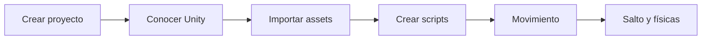

# Videojuegos 2D con Unity

Esta sección reúne la ruta inicial para trabajar con **Unity 6** desde cero.

!!! tip "Orden recomendado"
    Sigue las páginas del menú de izquierda a derecha. Cada bloque parte de lo realizado en el anterior.

## Ruta

1. [Crear el proyecto](01-primer-proyecto.md)
2. [Conocer el entorno de Unity](02-entorno-unity.md)
3. [Assets y sprites](03-assets-sprites.md)
4. [Primer script](04-primer-script.md)
5. [Movimiento y salto](05-movimiento-salto.md)
