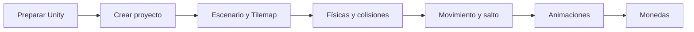

# Videojuegos 2D con Unity

En este bloque trabajaremos la creación de un videojuego de plataformas 2D con **Unity 6**, comenzando desde la preparación del entorno y avanzando hasta incorporar físicas, movimiento, salto, animaciones y objetos recogibles.

-   :material-gamepad-variant:{ .lg .middle } **ERCIGAME 2D · Primeros pasos**

    ---

    Práctica completa: proyecto Universal 2D, Tilemap, colisiones, Player, movimiento, salto, Animator y monedas.

    [:octicons-arrow-right-24: Abrir la práctica](ercigame-2d-primeros-pasos.md)

## Esquema de trabajo

## Apuntes por contenidos

1. [Crear el proyecto](01-primer-proyecto.md)
2. [Conocer el entorno de Unity](02-entorno-unity.md)
3. [Assets y sprites](03-assets-sprites.md)
4. [Primer script](04-primer-script.md)
5. [Movimiento y salto](05-movimiento-salto.md)
