# Videojuegos 2D con Unity

En este bloque construiremos paso a paso un videojuego de plataformas 2D con **Unity 6**. Iremos incorporando las distintas partes del juego a medida que avancemos en clase.

## Ruta de aprendizaje

```mermaid
flowchart LR
    A[Crear proyecto] --> B[Entorno de Unity]
    B --> C[Assets y sprites]
    C --> D[Primer script]
    D --> E[Movimiento y salto]
    E --> F[Ejemplo ERCIGAME]
    F --> G[Tilemap y escenario]
    G --> H[Colisiones y físicas]
    H --> I[Animaciones]
    I --> J[Orientación]
    J --> K[Objetos recogibles]
    K --> L[Tu propio videojuego]
```

## Primeros pasos

-   :material-numeric-1-box:{ .lg .middle } **Crear el proyecto**

    ---

    Unity Hub, proyecto Universal 2D, Rider y organización inicial.

    [:octicons-arrow-right-24: Abrir](01-primer-proyecto.md)

-   :material-numeric-2-box:{ .lg .middle } **Entorno de Unity**

    ---

    Hierarchy, Scene, Game, Inspector, Project, Console y componentes.

    [:octicons-arrow-right-24: Abrir](02-entorno-unity.md)

-   :material-numeric-3-box:{ .lg .middle } **Assets y sprites**

    ---

    Importación, configuración de pixel art y spritesheets.

    [:octicons-arrow-right-24: Abrir](03-assets-sprites.md)

-   :material-numeric-4-box:{ .lg .middle } **Primer script**

    ---

    MonoBehaviour, `Start()`, `Update()` y primeros mensajes en consola.

    [:octicons-arrow-right-24: Abrir](04-primer-script.md)

-   :material-numeric-5-box:{ .lg .middle } **Movimiento y salto**

    ---

    Rigidbody2D, movimiento horizontal, GroundCheck y salto.

    [:octicons-arrow-right-24: Abrir](05-movimiento-salto.md)

## Ejemplo de clase

-   :material-gamepad-variant:{ .lg .middle } **ERCIGAME 2D**

    ---

    Ejemplo completo que reúne en un único proyecto lo que vamos construyendo en clase: escenario, físicas, movimiento, salto, animaciones y objetos recogibles.

    [:octicons-arrow-right-24: Ver ejemplo](ercigame-2d-primeros-pasos.md)

## Seguimos construyendo el juego

-   :material-grid:{ .lg .middle } **6. Escenario con Tilemap**

    ---

    Grid, Tile Palette, Ground, Decoration y fondo.

    [:octicons-arrow-right-24: Abrir](06-tilemap-escenario.md)

-   :material-vector-square:{ .lg .middle } **7. Colisiones y físicas**

    ---

    Colliders, Composite Collider y Physics Material 2D.

    [:octicons-arrow-right-24: Abrir](07-colisiones-fisicas.md)

-   :material-animation-play:{ .lg .middle } **8. Animaciones**

    ---

    Idle, Run, Jump, Animator Controller y parámetros.

    [:octicons-arrow-right-24: Abrir](08-animaciones.md)

-   :material-flip-horizontal:{ .lg .middle } **9. Orientación del personaje**

    ---

    Cambio de dirección utilizando `SpriteRenderer.flipX`.

    [:octicons-arrow-right-24: Abrir](09-orientacion-personaje.md)

-   :material-star-circle:{ .lg .middle } **10. Objetos recogibles**

    ---

    Triggers, tags y una primera mecánica de monedas.

    [:octicons-arrow-right-24: Abrir](10-objetos-recogibles.md)

## Práctica

-   :material-hammer-wrench:{ .lg .middle } **Crea tu propio videojuego 2D**

    ---

    Reproduce lo trabajado en clase utilizando otros assets, otro tileset y un nivel diseñado por ti.

    [:octicons-arrow-right-24: Ver ejercicio](11-ejercicio-propio-juego.md)

