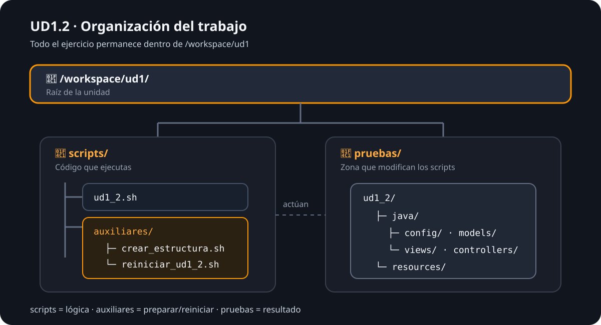

# UD1.2 · Rutas, ficheros y directorios

En este ejercicio vas a construir un pequeño entorno de trabajo utilizando **Bash**. Practicarás rutas absolutas y relativas, creación de directorios y ficheros, copias, movimientos, borrado, funciones y un menú interactivo.

!!! info "Entorno de trabajo"
    Todo se realiza desde el **terminal integrado de VS Code** y dentro de `/workspace/ud1`.

    No trabajes directamente en otras rutas del sistema.

## 1. Organización del ejercicio

Vamos a separar el **script principal**, los **scripts auxiliares** y los **ficheros de prueba**.



La estructura general será:

```text
/workspace/ud1/
├── scripts/
│   ├── ud1_2.sh
│   └── auxiliares/
│       ├── crear_estructura.sh
│       └── reiniciar_ud1_2.sh
└── pruebas/
    └── ud1_2/
```

### ¿Para qué sirve cada parte?

| Ruta | Uso |
|---|---|
| `scripts/ud1_2.sh` | Script principal. Contendrá el menú y las operaciones del ejercicio. |
| `scripts/auxiliares/crear_estructura.sh` | Genera la estructura inicial sobre la que vas a trabajar. |
| `scripts/auxiliares/reiniciar_ud1_2.sh` | Permite borrar la prueba y volver a crearla para repetir el ejercicio. |
| `pruebas/ud1_2/` | Zona de pruebas. Aquí se crean, copian, mueven y eliminan los ficheros. |

!!! warning "Regla importante"
    Todo lo que genere el ejercicio debe quedar dentro de `/workspace/ud1`. No utilices tu carpeta personal ni otras ubicaciones para resolverlo.

## 2. Script auxiliar: crear la estructura

Crea:

```text
/workspace/ud1/scripts/auxiliares/crear_estructura.sh
```

Este script debe crear automáticamente la siguiente estructura dentro de `/workspace/ud1/pruebas/ud1_2`:

```text
ud1_2/
├── java/
│   ├── config/
│   │   └── WebSocketConfig.java
│   ├── models/
│   │   └── MessageModel.java
│   ├── views/
│   │   ├── popups/
│   │   │   └── RegisterPopup.xaml
│   │   └── panels/
│   │       ├── MainView.xaml
│   │       └── LoginView.xaml
│   └── controllers/
└── resources/
    ├── documentos/
    ├── img/
    │   ├── logo.png
    │   ├── btn1.png
    │   ├── bt2.jpg
    │   ├── bt3.jpg
    │   └── bt4.png
    └── application.properties
```

Los ficheros pueden estar vacíos. Lo importante es construir correctamente la estructura utilizando comandos de Linux.

Cuando termines, debes poder ejecutar:

```bash
bash /workspace/ud1/scripts/auxiliares/crear_estructura.sh
```

y comprobar el resultado con:

```bash
tree /workspace/ud1/pruebas/ud1_2
```

## 3. Script auxiliar: reiniciar el ejercicio

Crea también:

```text
/workspace/ud1/scripts/auxiliares/reiniciar_ud1_2.sh
```

Su objetivo será dejar el ejercicio preparado para empezar otra vez:

1. Eliminar `/workspace/ud1/pruebas/ud1_2` si existe.
2. Ejecutar `crear_estructura.sh` para volver a generar la estructura inicial.
3. Mostrar un mensaje indicando que el entorno se ha reiniciado.

!!! tip "¿Por qué hacemos un script de reinicio?"
    Durante el ejercicio vas a borrar y mover ficheros. Poder reconstruir el escenario inicial con un solo comando te permitirá repetir las pruebas sin crear todo manualmente otra vez.

## 4. Script principal `ud1_2.sh`

Crea ahora:

```text
/workspace/ud1/scripts/ud1_2.sh
```

El script mostrará este menú y permanecerá en ejecución hasta seleccionar **Salir**:

```text
=============================
          UD1.2
=============================
1. Ejecutar apartado 1
2. Reiniciar ejercicio
3. Mostrar estructura actual
4. Salir

Selecciona una opción [1-4]:
```

La opción **2** debe ejecutar el script auxiliar `reiniciar_ud1_2.sh` y la opción **3** debe mostrar con `tree` el estado actual de la zona de pruebas.

## 5. Función `mostrar`

Dentro de `ud1_2.sh`, crea una función llamada `mostrar` que reciba **un argumento** con la descripción de la última operación realizada.

Cada vez que se invoque debe:

1. Limpiar la pantalla.
2. Mostrar `OPERACIÓN:` seguido del argumento recibido.
3. Mostrar la estructura actual de `/workspace/ud1/pruebas/ud1_2` mediante `tree` y una **ruta absoluta**.
4. Realizar una pausa con `Pulsa una tecla para continuar...`.

Por ejemplo:

```text
OPERACIÓN: Crear directorio ViewModels

ESTRUCTURA ACTUAL:
.
├── java
│   ├── ...
└── resources
    └── ...

Pulsa una tecla para continuar...
```

## 6. Apartado 1

Crea una función `apartado1`. La opción **1** del menú debe llamarla y realizar las siguientes operaciones **en este orden**.

### 1. Crear `ViewModels`

Desplázate al directorio raíz `/` y utiliza una **ruta absoluta** para crear:

```text
/workspace/ud1/pruebas/ud1_2/java/ViewModels
```

Después:

```bash
mostrar "Crear directorio ViewModels"
```

### 2. Crear `MainViewModel.java`

Utilizando una **ruta absoluta**, crea dentro de `ViewModels`:

```text
MainViewModel.java
```

Después:

```bash
mostrar "Crear MainViewModel.java"
```

### 3. Crear `operations`

Desplázate hasta:

```text
/workspace/ud1/pruebas/ud1_2/java/views/panels
```

Desde esa ubicación utiliza una **ruta relativa** para crear `operations` directamente dentro de `ud1_2`.

Después:

```bash
mostrar "Crear directorio operations"
```

### 4. Copiar los JPG

Utilizando **rutas relativas**, copia dentro de `operations` todos los ficheros `.jpg` que se encuentran en `resources/img`.

Después:

```bash
mostrar "Copiar archivos jpg"
```

### 5. Copiar `config`

Desplázate hasta `ud1_2` y, utilizando **rutas relativas**, copia `java/config` y todo su contenido dentro de `operations`.

Después:

```bash
mostrar "Copiar directorio config"
```

### 6. Borrar el `config` original

Utilizando una **ruta relativa**, elimina el directorio `java/config` original.

Después:

```bash
mostrar "Borrar directorio config"
```

### 7. Borrar los PNG

Utilizando una **ruta absoluta**, elimina todos los ficheros `.png` de:

```text
/workspace/ud1/pruebas/ud1_2/resources/img
```

Después:

```bash
mostrar "Borrar archivos png"
```

### 8. Recuperar `config`

Utilizando **rutas absolutas**, mueve el directorio `config` que copiaste en `operations` para volver a colocarlo dentro de `java`.

Después:

```bash
mostrar "Mover directorio config"
```

Al terminar, muestra un mensaje indicando que las operaciones se han realizado correctamente y vuelve al menú principal.

## 7. Comprobación

Antes de dar el ejercicio por terminado, comprueba:

- que el menú funciona y vuelve a mostrarse después de cada operación;
- que **Salir** finaliza el programa;
- que `crear_estructura.sh` genera correctamente el escenario inicial;
- que `reiniciar_ud1_2.sh` permite repetir el ejercicio;
- que has utilizado rutas absolutas o relativas exactamente donde se solicitan;
- que no has creado ficheros del ejercicio fuera de `/workspace/ud1`.

Puedes ayudarte de:

```bash
pwd
ls -la
tree /workspace/ud1
```

## 8. Sincroniza el trabajo con tu repositorio

Cuando el ejercicio funcione, sincroniza los cambios con **tu repositorio Git** desde `/workspace`.

Primero comprueba qué has modificado:

```bash
cd /workspace
git status
```

Añade los cambios y crea un commit:

```bash
git add ud1/
git commit -m "Completar ejercicio UD1.2"
```

Finalmente, sincroniza tu repositorio remoto:

```bash
git pull
git push
```

!!! info "Antes del `push`"
    Revisa siempre `git status`. No subas archivos que no formen parte de tu trabajo.

## Condiciones del ejercicio

- Debes utilizar **Bash**.
- Trabaja únicamente bajo `/workspace/ud1`.
- Respeta cuándo se solicita una **ruta absoluta** y cuándo una **ruta relativa**.
- Utiliza los comandos vistos en clase: `cd`, `pwd`, `ls`, `mkdir`, `touch`, `cp`, `mv`, `rm`, `clear`, `tree`, `echo` y `read`.
- El script principal debe utilizar funciones; como mínimo `mostrar` y `apartado1`.
- El menú debe repetirse hasta seleccionar **Salir**.
- Debes crear y utilizar los scripts auxiliares indicados.
- El resultado final debe quedar sincronizado con tu repositorio Git.
