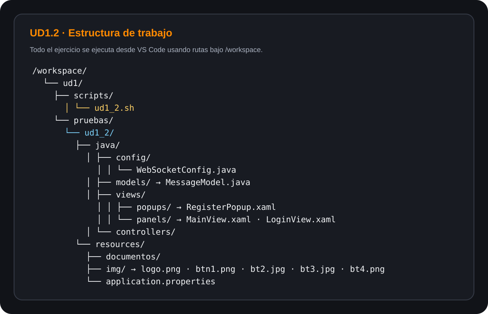

# UD1.2 · Rutas, ficheros y directorios con Bash

En este ejercicio vas a practicar **rutas absolutas y relativas**, creación de directorios y archivos, copia, movimiento y borrado desde un **script Bash**.

!!! info "Dónde trabajamos"
    El ejercicio se realiza desde el terminal integrado de **VS Code**. Para nosotros, la carpeta de trabajo es `/workspace`.

    No necesitas utilizar otras rutas del sistema para resolver el ejercicio.

## Preparación

Ya dispones de esta estructura de trabajo:

```text
/workspace/ud1/
├── pruebas/
└── scripts/
```

Crea:

- el script `/workspace/ud1/scripts/ud1_2.sh`;
- el directorio `/workspace/ud1/pruebas/ud1_2`, que contendrá los archivos y directorios generados por el ejercicio.

!!! warning "Importante"
    No crees los archivos del ejercicio fuera de `/workspace/ud1`. La estructura que vas a modificar estará siempre dentro de `/workspace/ud1/pruebas/ud1_2`.

## Estructura inicial esperada

Tu script debe generar inicialmente la siguiente estructura:



```text
/workspace/ud1/pruebas/ud1_2/
├── java/
│   ├── config/
│   │   └── WebSocketConfig.java
│   ├── models/
│   │   └── MessageModel.java
│   ├── views/
│   │   ├── popups/
│   │   │   └── RegisterPopup.xaml
│   │   └── panels/
│   │       ├── MainView.xaml
│   │       └── LoginView.xaml
│   └── controllers/
└── resources/
    ├── documentos/
    ├── img/
    │   ├── logo.png
    │   ├── btn1.png
    │   ├── bt2.jpg
    │   ├── bt3.jpg
    │   └── bt4.png
    └── application.properties
```

Los archivos pueden estar vacíos. Lo importante en esta parte es crear correctamente la estructura.

## Menú principal

El script debe mostrar un menú y mantenerse en ejecución hasta que el usuario seleccione **Salir**.

```text
MENU

1. APARTADO 1
2. Salir

Selecciona una opción [1-2]:
```

## Función `mostrar`

Crea una función llamada `mostrar` que reciba **un argumento** con la descripción de la operación realizada.

Cada vez que se invoque debe:

1. Limpiar la pantalla.
2. Mostrar `OPERACIÓN:` seguido del argumento recibido.
3. Mostrar la **estructura inicial de referencia** del ejercicio.
4. Mostrar la **estructura actual** de `/workspace/ud1/pruebas/ud1_2` utilizando `tree` y una **ruta absoluta**.
5. Realizar una pausa con un mensaje similar a `Pulsa una tecla para continuar...`.

Ejemplo:

```text
OPERACIÓN: Crear directorio ViewModels

ESTRUCTURA INICIAL:
...

ESTRUCTURA ACTUAL:
...

Pulsa una tecla para continuar...
```

## Apartado 1

Crea una función llamada `apartado1`. Al seleccionar la opción **1** del menú debe realizar, **en este orden**, las siguientes operaciones.

### 1. Crear `ViewModels`

Desplázate al directorio raíz `/` y, utilizando una **ruta absoluta**, crea el directorio:

```text
/workspace/ud1/pruebas/ud1_2/java/ViewModels
```

Después llama a:

```text
mostrar "Crear directorio ViewModels"
```

### 2. Crear `MainViewModel.java`

Utilizando una **ruta absoluta**, crea dentro de `ViewModels` el archivo:

```text
MainViewModel.java
```

Después:

```text
mostrar "Crear MainViewModel.java"
```

### 3. Crear `operations`

Desplázate hasta:

```text
/workspace/ud1/pruebas/ud1_2/java/views/panels
```

Desde esa ubicación y utilizando una **ruta relativa**, crea el directorio `operations` directamente dentro de `ud1_2`.

Después:

```text
mostrar "Crear directorio operations"
```

### 4. Copiar los JPG

Sin abandonar el trabajo con **rutas relativas**, copia en `operations` todos los archivos con extensión `.jpg` que se encuentran en `resources/img`.

Después:

```text
mostrar "Copiar archivos jpg"
```

### 5. Copiar `config`

Desplázate hasta el directorio `ud1_2` y, utilizando **rutas relativas**, copia el directorio `java/config` y todo su contenido dentro de `operations`.

Después:

```text
mostrar "Copiar directorio config"
```

### 6. Borrar el `config` original

Utilizando una **ruta relativa**, elimina el directorio `java/config` original.

Después:

```text
mostrar "Borrar directorio config"
```

### 7. Borrar los PNG

Utilizando una **ruta absoluta**, elimina todos los archivos con extensión `.png` del directorio:

```text
/workspace/ud1/pruebas/ud1_2/resources/img
```

Después:

```text
mostrar "Borrar archivos png"
```

### 8. Recuperar `config`

Utilizando **rutas absolutas**, mueve el directorio `config` que habías copiado dentro de `operations` para volver a colocarlo dentro de `java`.

Después:

```text
mostrar "Mover directorio config"
```

Finalmente, muestra un mensaje indicando que las operaciones se han realizado correctamente y vuelve al menú principal.

## Condiciones del ejercicio

- El script debe ejecutarse con Bash.
- Debes respetar cuándo se pide una **ruta absoluta** y cuándo una **ruta relativa**.
- Utiliza comandos vistos en clase: `cd`, `mkdir`, `touch`, `cp`, `mv`, `rm`, `clear`, `tree`, `echo` y `read`.
- El menú debe repetirse hasta seleccionar **Salir**.
- Divide el script en funciones; como mínimo deben existir `mostrar` y `apartado1`.
- No utilices rutas distintas a las indicadas para simplificar el ejercicio.

!!! tip "Antes de ejecutar"
    Comprueba dónde estás con `pwd` y revisa la estructura con `tree /workspace/ud1`. Durante el desarrollo también puedes utilizar `ls` para comprobar cada paso.
